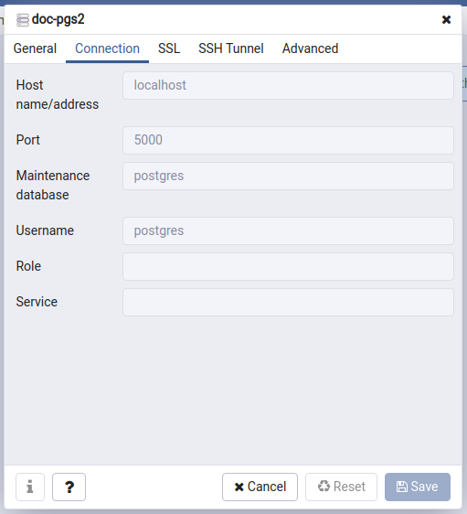

# Databases running inside Docker

## MongoDB

Installing MongoDB from container:
```
$ sudo docker images
$ sudo docker pull mongo:latest
$ sudo docker images
```

Create a folder in **/home/user-name** folder:
```
$ cd ~
$ mkdir mongodb-docker
$ cd mongodb-docker
$ sudo docker run -d -p 2717:27017 -v ~/mongodb-docker:/data/db --name mymongo mongo:latest
$ sudo docker ps -a
$ sudo docker exec -it mymongo bash
/# mongo
> show dbs
> use test
> db.user.insert({"name": "Shahjalal"})
> db.user.find()
> exit
/# exit
```

From the local terminal:
```
$ sudo apt install mongodb-clients
$ mongo localhost:2717
> show dbs
> use test
> db.user.find()
> exit
```

Stop docker running container:
```
$ sudo docker ps -a
$ sudo docker stop e98d524d5562
$ sudo docker ps -a
$ sudo docker rm 05a1fd72c2bd e98d524d5562
```


## Postgres

Installing Postgres from container:
```
$ sudo docker images
$ sudo docker pull postgres:latest
$ sudo docker images
```

Create a folder in **/home/user-name** folder:
```
$ cd ~
$ mkdir postgres-docker
$ cd postgres-docker
$ sudo docker run -d --name=postgres -p 5000:5432 -e POSTGRES_PASSWORD=admin1234 -e PGDATA=/pgdata -v ~/postgres-docker:/pgdata postgres:latest
$ sudo docker ps -a
$ sudo docker exec -it postgres psql -U postgres

postgres=# CREATE DATABASE demo_db1;
CREATE DATABASE
postgres=# \c demo_db1; 
postgres=# CREATE TABLE demo_t(something int);
CREATE TABLE
postgres=# INSERT INTO demo_t (something) VALUES (1);
INSERT 0 1
postgres=# \dt
         List of relations
 Schema |  Name  | Type  |  Owner   
--------+--------+-------+----------
 public | demo_t | table | postgres
(1 row)
postgres=# SELECT * FROM demo_t;
 something 
-----------
         1
(1 row)

postgres=# \q

```

Connecting local PgAdmin with docker-postgres:



After completing task simple close the container and data will be persistent- 
```
$ sudo docker stop <container-id>
$ sudo docker ps -a
$ sudo docker rm -f <container-id>
```
